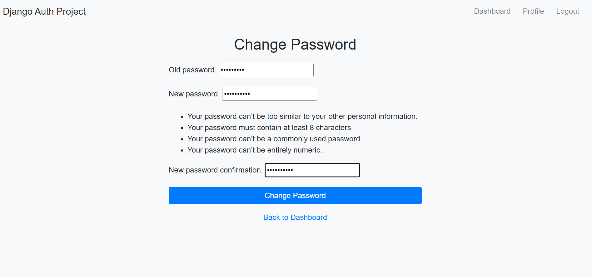

    

<h1 align="center"> Django Auth </h1>

## Overview

Django Auth application with the following functionality:

1. User authentication with email or username and password.
2. Pages for Login, Signup, Forgot Password, Change Password, Dashboard, Profile and Reset Password with Email Verification.
3. Restricting access to certain pages based on authentication status.





### Run Scripts

```
git clone https://github.com/shhiivvaam/django-auth.git

cd django-auth

# Create a virtual environment
python -m venv env

cd env\Scripts
activate

cd ../../       # come back to the base root dir of the file

cd core         # First go to the core folder, which contains the manage.py file

# Run migrations
python manage.py migrate    # or you can proceed without doing this

# Create a superuser
python manage.py createsuperuser

# Start the development server
python manage.py runserver
```

Environment Variables
Create a .env file in the project directory and add these environment variables or else directly change the configs in the `core/settings.py`

```
# Django settings
DEBUG=True
SECRET_KEY=your_secret_key
ALLOWED_HOSTS=localhost, 127.0.0.1

# Email settings
EMAIL_BACKEND = django.core.mail.backends.smtp.EmailBackend
EMAIL_HOST = smtp.gmail.com
EMAIL_PORT = 587
EMAIL_USE_TLS = True
EMAIL_HOST_USER = your_email@gmail.com
EMAIL_HOST_PASSWORD = your_email_password  # This should not be the actuall password of your Google Account but the App Password that generally you have to create from the Security Tabs in the Manage Account Section of Settings Page on your Google Account
```
